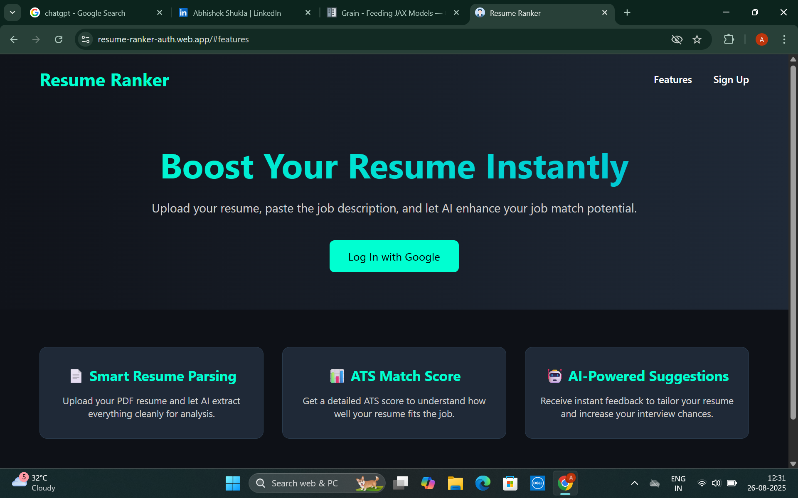

# Resume Ranker - AI-Powered Resume Analysis & Optimization Tool

[](https://www.python.org/)
[](https://streamlit.io/)
[](LICENSE)

**Resume Ranker** is an AI-driven web application that analyzes resumes against job descriptions and provides actionable feedback to improve your chances of getting noticed by recruiters.

---

## 🔹 Features

- **Resume Scoring:** Get a comprehensive ATS-compatible score for your resume based on the job description.
- **Keyword Matching:** Highlights missing or underrepresented keywords and skills compared to the job description.
- **Content Suggestions:** Recommendations to improve language, structure, and relevance.
- **Section Analysis:** Evaluates experience, education, skills, and certifications for completeness and impact.
- **Secure Login:** Users can sign up and log in securely to track their resume analyses.
- **Premium Features (Upcoming):** Advanced scoring, downloadable reports, and personalized optimization tips.

---

## 🖥️ Demo / Screenshots

### Upload & Analysis


### Resume Score & Suggestions


> 

---

## ⚙️ Tech Stack

- **Frontend:** Streamlit  
- **Backend:** FastAPI / Python  
- **AI Models:** Groq API with Mixtral-8x7B for fast NLP processing  
- **Authentication:** Firebase Admin SDK (Google Login)  
- **Database:** Firestore  

---

## 🚀 How It Works

1. **Upload Resume & Job Description:** Users upload their resume and the corresponding job description.
2. **Analysis:** The AI model analyzes the resume for keyword alignment, formatting, and content relevance.
3. **Score & Suggestions:** Users receive a score and actionable suggestions to improve their resume.
4. **Transform Your Resume Into AN ATS-Friendly Format:**  Users can transform there resume according to JD into ATS friendly template.

---

## 💻 Setup & Installation

1. Clone the repository:  
   ```bash
   git clone https://github.com/your-username/resume-ranker.git
   cd resume-ranker


2. Create a virtual environment and install dependencies:

python -m venv venv
source venv/bin/activate   # Linux / Mac
venv\Scripts\activate      # Windows
pip install -r requirements.txt

3. Run the Streamlit app:
streamlit run app.py

---
🔮Future Enhancements

-**Add payment gateway for premium features**.

-**Real-time AI suggestions while editing the resume**.

-**Multi-language resume optimization.**

-**LinkedIn integration for automatic suggestions.**